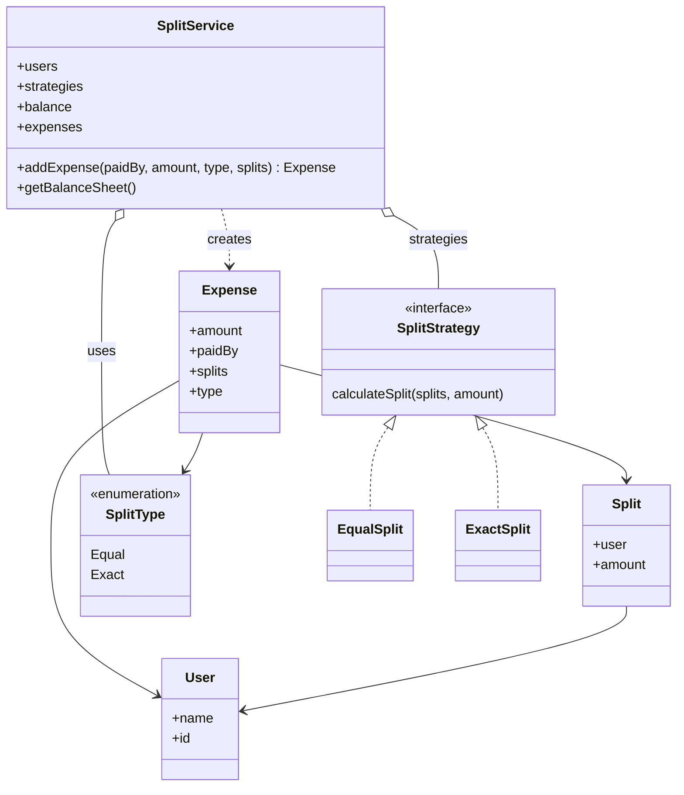
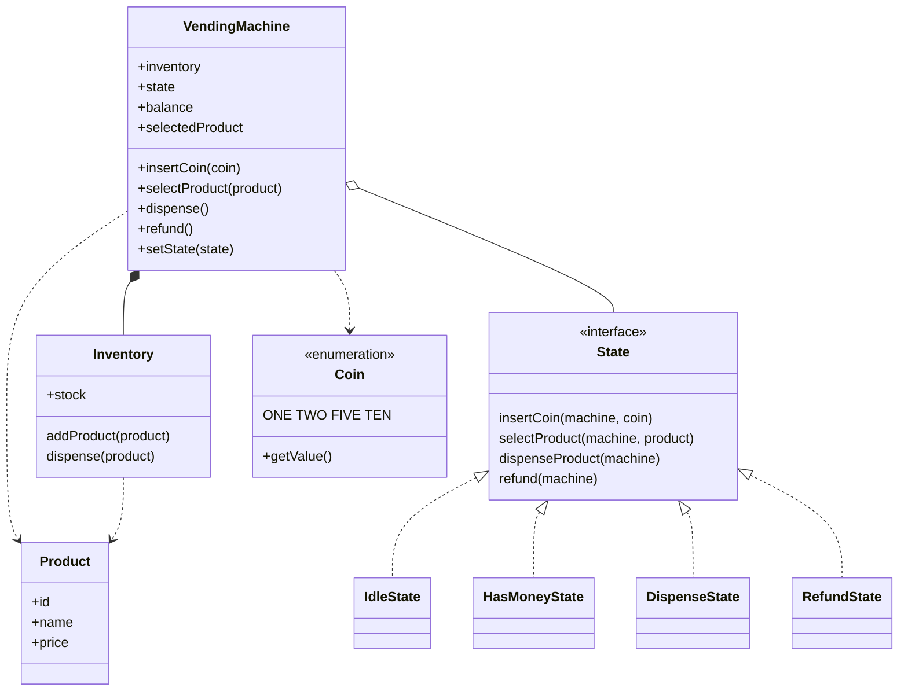
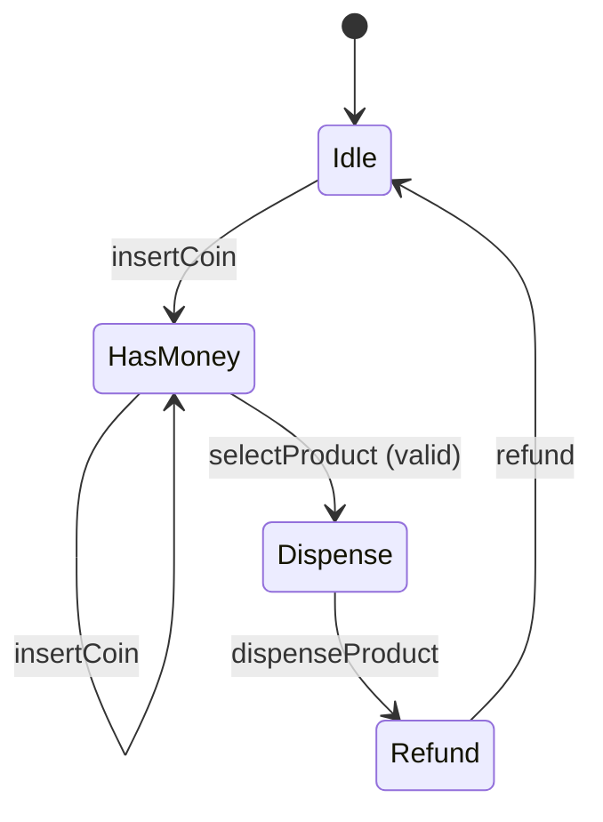
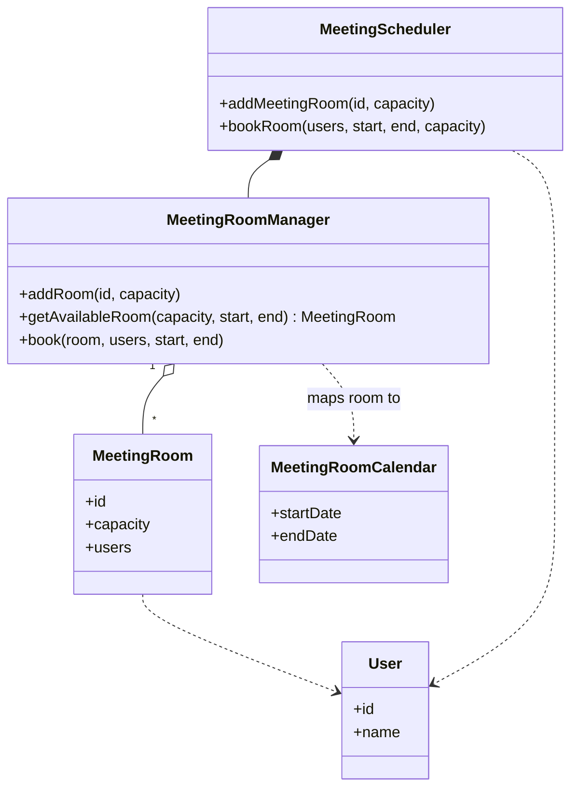
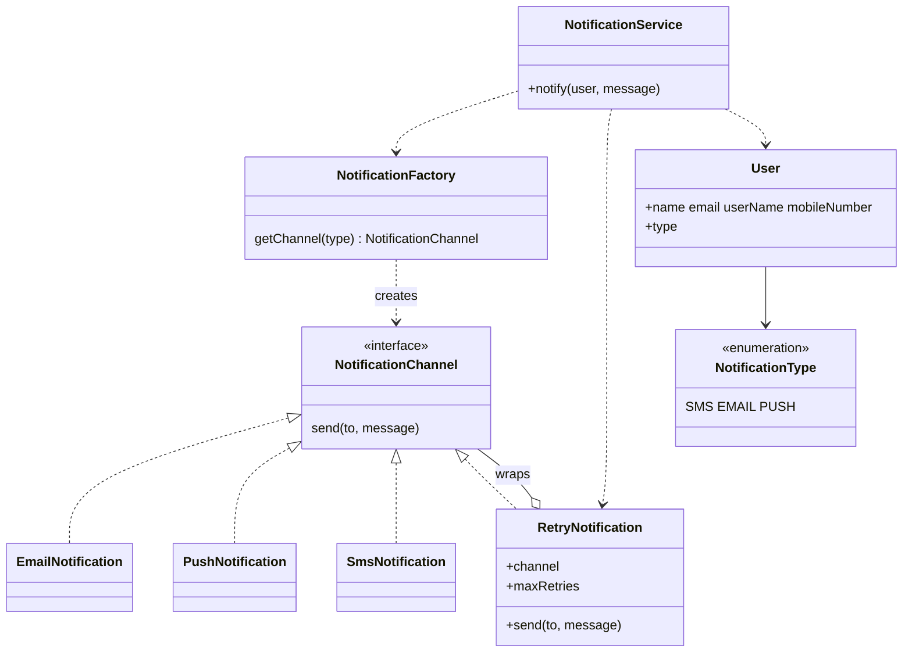
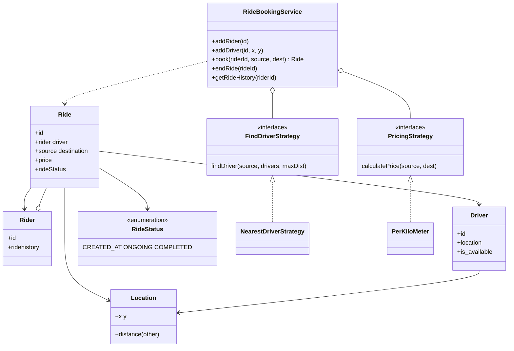
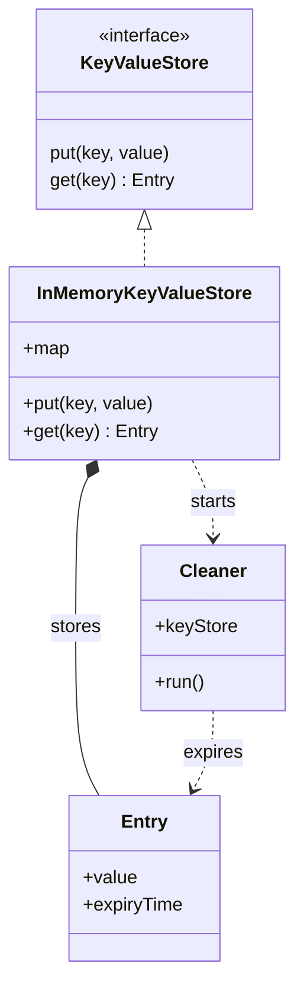
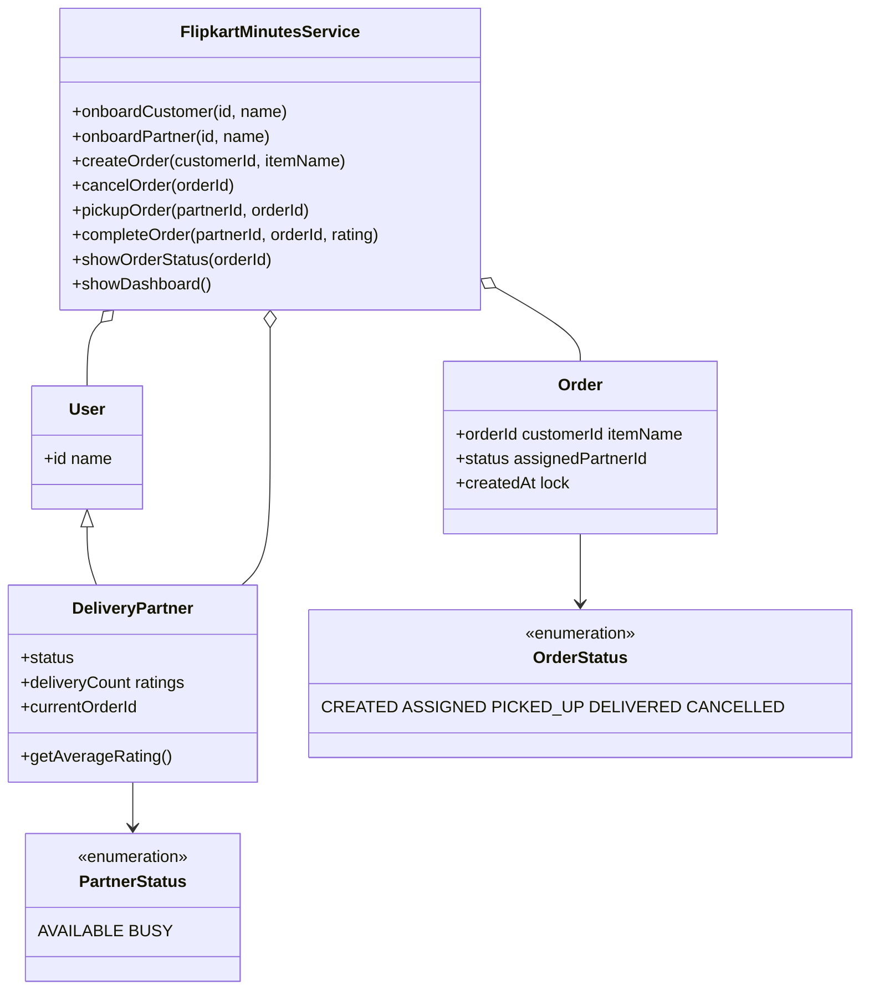

# Low Level Design

Small, self-contained Java modules demonstrating common LLD patterns (strategy, factory, decorator, state, and simple domain models). Each folder is its own Maven project under `org.example`.

## Modules

| Module | Focus |
|--------|--------|
| [Splitwise](Splitwise/) | Expense splitting with strategy (`Equal` / `Exact`) |
| [VendingMachine](VendingMachine/) | Vending flow with **State** pattern |
| [MeetingScheduler](MeetingScheduler/) | Rooms, calendars, booking |
| [NotificationSystem](NotificationSystem/) | Factory + **Decorator** (retry) for channels |
| [RideBooking](RideBooking/) | Nearest-driver + pricing **strategies** |
| [InMemoryKeyValue](InMemoryKeyValue/) | TTL store + background **Cleaner** thread |
| [FlipkarMinute](FlipkarMinute/) | Delivery / order lifecycle (demo types in `Main.java`) |

---

## Splitwise

---

## VendingMachine

**State transitions (State pattern)**

---

## MeetingScheduler

---

## NotificationSystem

---

## RideBooking

---

## InMemoryKeyValue

---

## FlipkarMinute

Core types for the quick-commerce demo live in [`FlipkarMinute/src/main/java/org/example/Main.java`](FlipkarMinute/src/main/java/org/example/Main.java) (single file).

---

## Rendering

GitHub (and many Markdown viewers) render **Mermaid** natively. In VS Code / Cursor, use a Mermaid preview extension if diagrams do not show inline.
