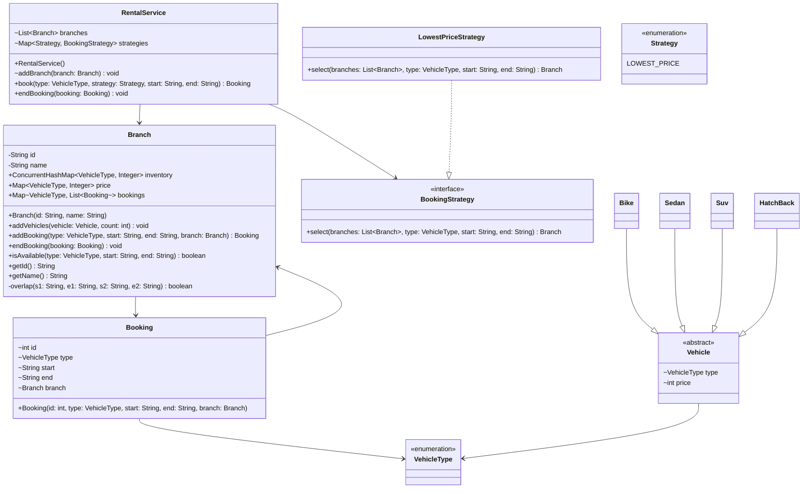
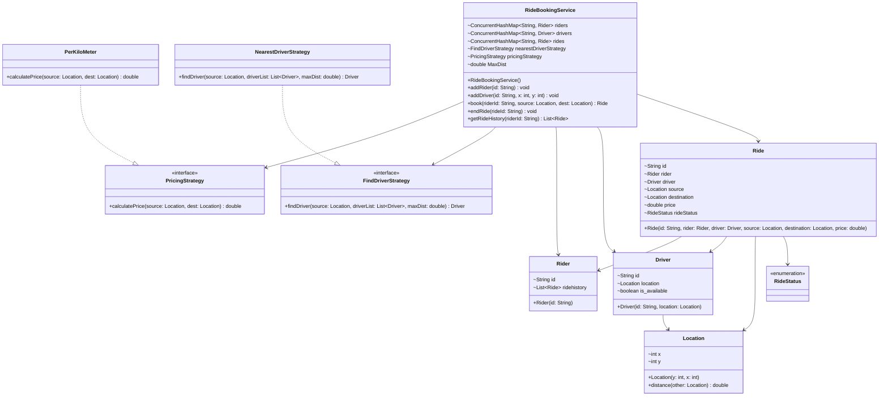
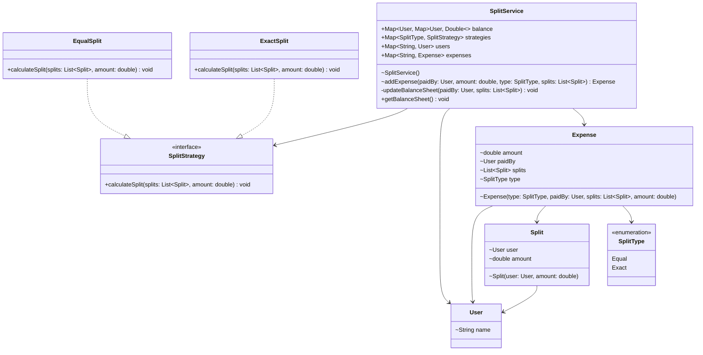
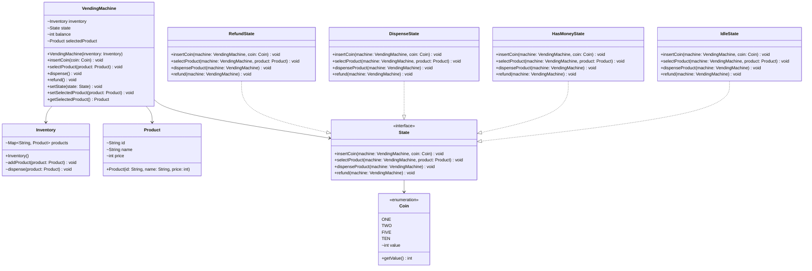
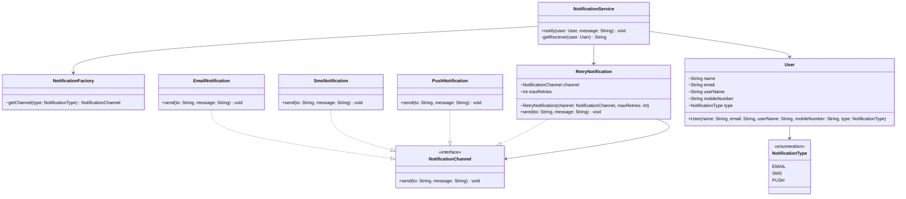
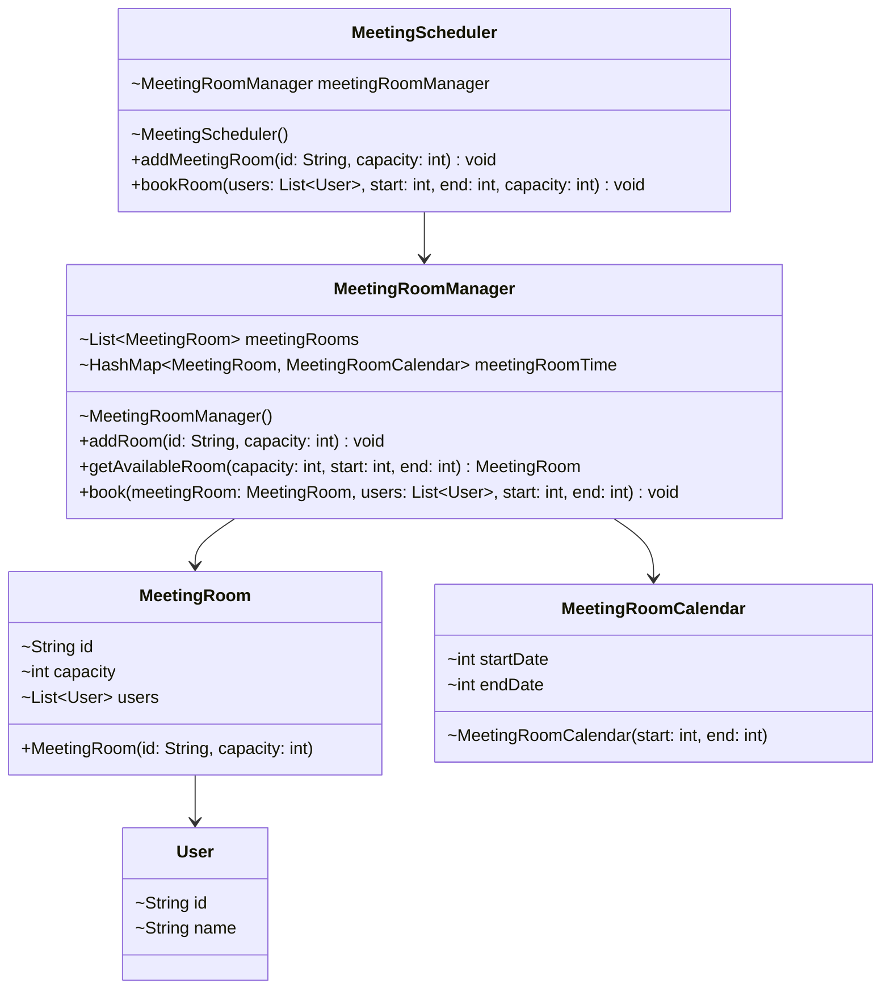
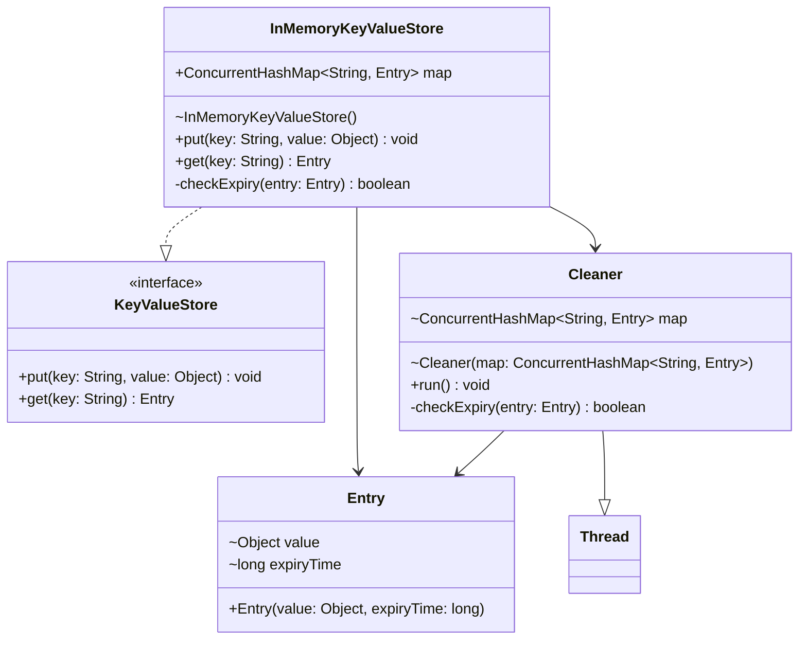
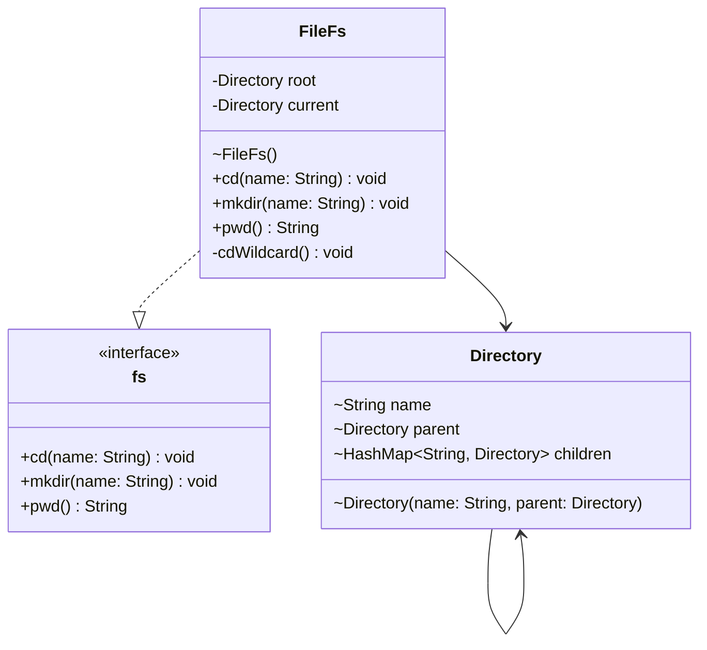
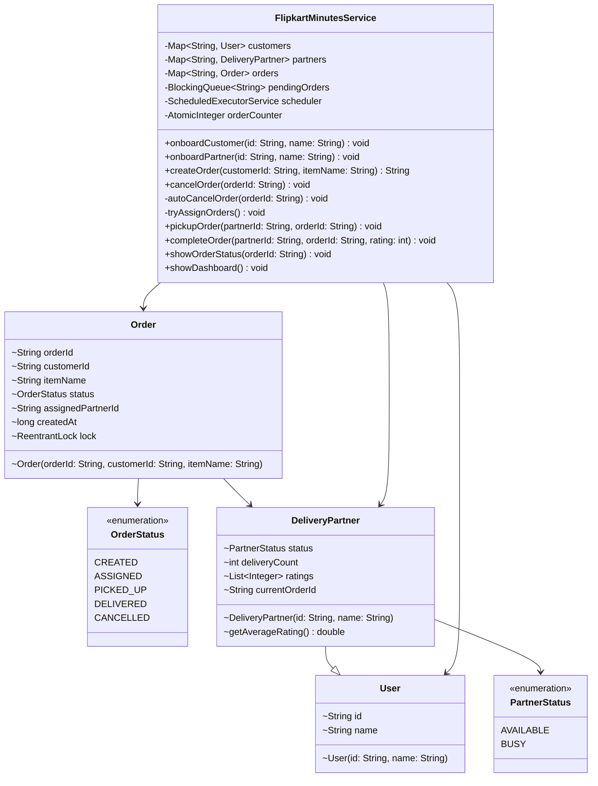

# LowLevelDesign

Detailed UML reference (class members + relationships) for all modules.

## FoodDelivery

```mermaid
classDiagram
class DeliveryService {
  ~HashMap~String, Restaurant~ restaurants
  ~HashMap~String, Driver~ drivers
  ~HashMap~PaymentMethod, PaymentStrategy~ paymentStrategies
  +addDriver(driver: Driver) void
  +addRestaurant(restaurant: Restaurant) void
  +orderFood(user: User, foodItems: List~FoodItems~, restaurant: Restaurant, method: PaymentMethod) Order
  ~deliverOrder(order: Order) Order
  ~findNearestDriver(restaurant: Restaurant) Driver
}
class User {
  ~String name
  ~String id
  ~Location location
  ~HashMap~String, Order~ orderHistory
  +User(name: String, id: String, location: Location)
}
class Driver {
  ~String id
  ~String name
  ~Location location
  ~boolean is_available
  ~HashMap~String, Order~ orderHistory
  +Driver(id: String, name: String, location: Location)
}
class Restaurant {
  ~String id
  ~String name
  ~Location location
  ~HashMap~FoodItems, Boolean~ menu
  +Restaurant(id: String, name: String, location: Location, menu: HashMap~FoodItems, Boolean~)
}
class Order {
  ~String id
  ~Restaurant restaurantId
  ~User userId
  ~double amount
  ~List~FoodItems~ foodItemsId
  ~OrderStatus status
  ~String paymentId
  ~Driver driver
  +Order(id: String, restaurantId: Restaurant, amount: double, userId: User, foodItemsId: List~FoodItems~, status: OrderStatus)
}
class FoodItems {
  ~String id
  ~String name
  ~double price
  +FoodItems(id: String, name: String, price: double)
}
class Location {
  ~int x
  ~int y
  +Location(x: int, y: int)
  ~distance(other: Location) double
}
class PaymentStrategy {
  <<interface>>
  +payment(user: User, amount: Double, order: Order) void
}
class StripePayment {
  +payment(user: User, amount: Double, order: Order) void
}
class PaypalPayment {
  +payment(user: User, amount: Double, order: Order) void
}
class UpiPayment {
  +payment(user: User, amount: Double, order: Order) void
}
class PaymentMethod {
  <<enumeration>>
  Paypal
  Stripe
  UPI
}
class OrderStatus {
  <<enumeration>>
  Created
  Accepted
  OutForDelivery
  Delivered
  Failed
}
StripePayment ..|> PaymentStrategy
PaypalPayment ..|> PaymentStrategy
UpiPayment ..|> PaymentStrategy
DeliveryService --> Restaurant
DeliveryService --> Driver
DeliveryService --> PaymentStrategy
Order --> User
Order --> Restaurant
Order --> Driver
Order --> FoodItems
User --> Location
Driver --> Location
Restaurant --> Location
Order --> OrderStatus
```

## VehicleRental

```mermaid
classDiagram
class RentalService {
  ~List~Branch~ branches
  ~Map~Strategy, BookingStrategy~ strategies
  +RentalService()
  ~addBranch(branch: Branch) void
  +book(type: VehicleType, strategy: Strategy, start: String, end: String) Booking
  +endBooking(booking: Booking) void
}
class Branch {
  -String id
  -String name
  +ConcurrentHashMap~VehicleType, Integer~ inventory
  +Map~VehicleType, Integer~ price
  +Map~VehicleType, List~Booking~~ bookings
  +Branch(id: String, name: String)
  +addVehicles(vehicle: Vehicle, count: int) void
  +addBooking(type: VehicleType, start: String, end: String, branch: Branch) Booking
  +endBooking(booking: Booking) void
  +isAvailable(type: VehicleType, start: String, end: String) boolean
  +getId() String
  +getName() String
  -overlap(s1: String, e1: String, s2: String, e2: String) boolean
}
class Booking {
  ~int id
  ~VehicleType type
  ~String start
  ~String end
  ~Branch branch
  +Booking(id: int, type: VehicleType, start: String, end: String, branch: Branch)
}
class BookingStrategy {
  <<interface>>
  +select(branches: List~Branch~, type: VehicleType, start: String, end: String) Branch
}
class LowestPriceStrategy {
  +select(branches: List~Branch~, type: VehicleType, start: String, end: String) Branch
}
class Vehicle {
  <<abstract>>
  ~VehicleType type
  ~int price
}
class Bike
class Sedan
class Suv
class HatchBack
class VehicleType {
  <<enumeration>>
}
class Strategy {
  <<enumeration>>
  LOWEST_PRICE
}
LowestPriceStrategy ..|> BookingStrategy
Bike --|> Vehicle
Sedan --|> Vehicle
Suv --|> Vehicle
HatchBack --|> Vehicle
Branch --> Booking
Booking --> Branch
Booking --> VehicleType
Vehicle --> VehicleType
RentalService --> Branch
RentalService --> BookingStrategy
```

## RideBooking

```mermaid
classDiagram
class RideBookingService {
  ~ConcurrentHashMap~String, Rider~ riders
  ~ConcurrentHashMap~String, Driver~ drivers
  ~ConcurrentHashMap~String, Ride~ rides
  ~FindDriverStrategy nearestDriverStrategy
  ~PricingStrategy pricingStrategy
  ~double MaxDist
  +RideBookingService()
  +addRider(id: String) void
  +addDriver(id: String, x: int, y: int) void
  +book(riderId: String, source: Location, dest: Location) Ride
  +endRide(rideId: String) void
  +getRideHistory(riderId: String) List~Ride~
}
class Rider {
  ~String id
  ~List~Ride~ ridehistory
  +Rider(id: String)
}
class Driver {
  ~String id
  ~Location location
  ~boolean is_available
  +Driver(id: String, location: Location)
}
class Ride {
  ~String id
  ~Rider rider
  ~Driver driver
  ~Location source
  ~Location destination
  ~double price
  ~RideStatus rideStatus
  +Ride(id: String, rider: Rider, driver: Driver, source: Location, destination: Location, price: double)
}
class Location {
  ~int x
  ~int y
  +Location(y: int, x: int)
  +distance(other: Location) double
}
class PricingStrategy {
  <<interface>>
  +calculatePrice(source: Location, dest: Location) double
}
class PerKiloMeter {
  +calculatePrice(source: Location, dest: Location) double
}
class FindDriverStrategy {
  <<interface>>
  +findDriver(source: Location, driverList: List~Driver~, maxDist: double) Driver
}
class NearestDriverStrategy {
  +findDriver(source: Location, driverList: List~Driver~, maxDist: double) Driver
}
class RideStatus {
  <<enumeration>>
}
PerKiloMeter ..|> PricingStrategy
NearestDriverStrategy ..|> FindDriverStrategy
Ride --> Rider
Ride --> Driver
Ride --> Location
Ride --> RideStatus
Driver --> Location
RideBookingService --> PricingStrategy
RideBookingService --> FindDriverStrategy
RideBookingService --> Rider
RideBookingService --> Driver
RideBookingService --> Ride
```

## Splitwise

```mermaid
classDiagram
class SplitService {
  +Map~User, Map~User, Double~~ balance
  +Map~SplitType, SplitStrategy~ strategies
  +Map~String, User~ users
  +Map~String, Expense~ expenses
  ~SplitService()
  ~addExpense(paidBy: User, amount: double, type: SplitType, splits: List~Split~) Expense
  -updateBalanceSheet(paidBy: User, splits: List~Split~) void
  +getBalanceSheet() void
}
class User {
  ~String name
}
class Expense {
  ~double amount
  ~User paidBy
  ~List~Split~ splits
  ~SplitType type
  ~Expense(type: SplitType, paidBy: User, splits: List~Split~, amount: double)
}
class Split {
  ~User user
  ~double amount
  ~Split(user: User, amount: double)
}
class SplitType {
  <<enumeration>>
  Equal
  Exact
}
class SplitStrategy {
  <<interface>>
  +calculateSplit(splits: List~Split~, amount: double) void
}
class EqualSplit {
  +calculateSplit(splits: List~Split~, amount: double) void
}
class ExactSplit {
  +calculateSplit(splits: List~Split~, amount: double) void
}
EqualSplit ..|> SplitStrategy
ExactSplit ..|> SplitStrategy
Expense --> User
Expense --> Split
Expense --> SplitType
Split --> User
SplitService --> SplitStrategy
SplitService --> User
SplitService --> Expense
```

## VendingMachine

```mermaid
classDiagram
class VendingMachine {
  ~Inventory inventory
  ~State state
  ~int balance
  ~Product selectedProduct
  +VendingMachine(inventory: Inventory)
  +insertCoin(coin: Coin) void
  +selectProduct(product: Product) void
  +dispense() void
  +refund() void
  +setState(state: State) void
  +setSelectedProduct(product: Product) void
  +getSelectedProduct() Product
}
class Inventory {
  ~Map~String, Product~ products
  +Inventory()
  ~addProduct(product: Product) void
  ~dispense(product: Product) void
}
class Product {
  ~String id
  ~String name
  ~int price
  +Product(id: String, name: String, price: int)
}
class Coin {
  <<enumeration>>
  ONE
  TWO
  FIVE
  TEN
  ~int value
  +getValue() int
}
class State {
  <<interface>>
  +insertCoin(machine: VendingMachine, coin: Coin) void
  +selectProduct(machine: VendingMachine, product: Product) void
  +dispenseProduct(machine: VendingMachine) void
  +refund(machine: VendingMachine) void
}
class IdleState {
  +insertCoin(machine: VendingMachine, coin: Coin) void
  +selectProduct(machine: VendingMachine, product: Product) void
  +dispenseProduct(machine: VendingMachine) void
  +refund(machine: VendingMachine) void
}
class HasMoneyState {
  +insertCoin(machine: VendingMachine, coin: Coin) void
  +selectProduct(machine: VendingMachine, product: Product) void
  +dispenseProduct(machine: VendingMachine) void
  +refund(machine: VendingMachine) void
}
class DispenseState {
  +insertCoin(machine: VendingMachine, coin: Coin) void
  +selectProduct(machine: VendingMachine, product: Product) void
  +dispenseProduct(machine: VendingMachine) void
  +refund(machine: VendingMachine) void
}
class RefundState {
  +insertCoin(machine: VendingMachine, coin: Coin) void
  +selectProduct(machine: VendingMachine, product: Product) void
  +dispenseProduct(machine: VendingMachine) void
  +refund(machine: VendingMachine) void
}
IdleState ..|> State
HasMoneyState ..|> State
DispenseState ..|> State
RefundState ..|> State
VendingMachine --> Inventory
VendingMachine --> State
VendingMachine --> Product
State --> Coin
```

## NotificationSystem

```mermaid
classDiagram
class NotificationService {
  +notify(user: User, message: String) void
  -getReciever(user: User) String
}
class NotificationFactory {
  ~getChannel(type: NotificationType) NotificationChannel
}
class NotificationChannel {
  <<interface>>
  +send(to: String, message: String) void
}
class EmailNotification {
  +send(to: String, message: String) void
}
class SmsNotification {
  +send(to: String, message: String) void
}
class PushNotification {
  +send(to: String, message: String) void
}
class RetryNotification {
  ~NotificationChannel channel
  ~int maxRetries
  ~RetryNotification(channel: NotificationChannel, maxRetries: int)
  +send(to: String, message: String) void
}
class User {
  ~String name
  ~String email
  ~String userName
  ~String mobileNumber
  ~NotificationType type
  +User(name: String, email: String, userName: String, mobileNumber: String, type: NotificationType)
}
class NotificationType {
  <<enumeration>>
  EMAIL
  SMS
  PUSH
}
EmailNotification ..|> NotificationChannel
SmsNotification ..|> NotificationChannel
PushNotification ..|> NotificationChannel
RetryNotification ..|> NotificationChannel
RetryNotification --> NotificationChannel
NotificationService --> NotificationFactory
NotificationService --> RetryNotification
NotificationService --> User
User --> NotificationType
```

## MeetingScheduler

```mermaid
classDiagram
class MeetingScheduler {
  ~MeetingRoomManager meetingRoomManager
  ~MeetingScheduler()
  +addMeetingRoom(id: String, capacity: int) void
  +bookRoom(users: List~User~, start: int, end: int, capacity: int) void
}
class MeetingRoomManager {
  ~List~MeetingRoom~ meetingRooms
  ~HashMap~MeetingRoom, MeetingRoomCalendar~ meetingRoomTime
  ~MeetingRoomManager()
  +addRoom(id: String, capacity: int) void
  +getAvailableRoom(capacity: int, start: int, end: int) MeetingRoom
  +book(meetingRoom: MeetingRoom, users: List~User~, start: int, end: int) void
}
class MeetingRoom {
  ~String id
  ~int capacity
  ~List~User~ users
  +MeetingRoom(id: String, capacity: int)
}
class MeetingRoomCalendar {
  ~int startDate
  ~int endDate
  ~MeetingRoomCalendar(start: int, end: int)
}
class User {
  ~String id
  ~String name
}
MeetingScheduler --> MeetingRoomManager
MeetingRoomManager --> MeetingRoom
MeetingRoomManager --> MeetingRoomCalendar
MeetingRoom --> User
```

## InMemoryKeyValue

```mermaid
classDiagram
class KeyValueStore {
  <<interface>>
  +put(key: String, value: Object) void
  +get(key: String) Entry
}
class InMemoryKeyValueStore {
  +ConcurrentHashMap~String, Entry~ map
  ~InMemoryKeyValueStore()
  +put(key: String, value: Object) void
  +get(key: String) Entry
  -checkExpiry(entry: Entry) boolean
}
class Entry {
  ~Object value
  ~long expiryTime
  +Entry(value: Object, expiryTime: long)
}
class Cleaner {
  ~ConcurrentHashMap~String, Entry~ map
  ~Cleaner(map: ConcurrentHashMap~String, Entry~)
  +run() void
  -checkExpiry(entry: Entry) boolean
}
InMemoryKeyValueStore ..|> KeyValueStore
Cleaner --|> Thread
InMemoryKeyValueStore --> Entry
InMemoryKeyValueStore --> Cleaner
Cleaner --> Entry
```

## FileSystem

```mermaid
classDiagram
class fs {
  <<interface>>
  +cd(name: String) void
  +mkdir(name: String) void
  +pwd() String
}
class FileFs {
  -Directory root
  -Directory current
  ~FileFs()
  +cd(name: String) void
  +mkdir(name: String) void
  +pwd() String
  -cdWildcard() void
}
class Directory {
  ~String name
  ~Directory parent
  ~HashMap~String, Directory~ children
  ~Directory(name: String, parent: Directory)
}
FileFs ..|> fs
FileFs --> Directory
Directory --> Directory
```

## FlipkartMinute

```mermaid
classDiagram
class OrderStatus {
  <<enumeration>>
  CREATED
  ASSIGNED
  PICKED_UP
  DELIVERED
  CANCELLED
}
class PartnerStatus {
  <<enumeration>>
  AVAILABLE
  BUSY
}
class User {
  ~String id
  ~String name
  ~User(id: String, name: String)
}
class DeliveryPartner {
  ~PartnerStatus status
  ~int deliveryCount
  ~List~Integer~ ratings
  ~String currentOrderId
  ~DeliveryPartner(id: String, name: String)
  ~getAverageRating() double
}
class Order {
  ~String orderId
  ~String customerId
  ~String itemName
  ~OrderStatus status
  ~String assignedPartnerId
  ~long createdAt
  ~ReentrantLock lock
  ~Order(orderId: String, customerId: String, itemName: String)
}
class FlipkartMinutesService {
  -Map~String, User~ customers
  -Map~String, DeliveryPartner~ partners
  -Map~String, Order~ orders
  -BlockingQueue~String~ pendingOrders
  -ScheduledExecutorService scheduler
  -AtomicInteger orderCounter
  +onboardCustomer(id: String, name: String) void
  +onboardPartner(id: String, name: String) void
  +createOrder(customerId: String, itemName: String) String
  +cancelOrder(orderId: String) void
  -autoCancelOrder(orderId: String) void
  -tryAssignOrders() void
  +pickupOrder(partnerId: String, orderId: String) void
  +completeOrder(partnerId: String, orderId: String, rating: int) void
  +showOrderStatus(orderId: String) void
  +showDashboard() void
}
DeliveryPartner --|> User
DeliveryPartner --> PartnerStatus
Order --> OrderStatus
Order --> DeliveryPartner
FlipkartMinutesService --> User
FlipkartMinutesService --> DeliveryPartner
FlipkartMinutesService --> Order
```
