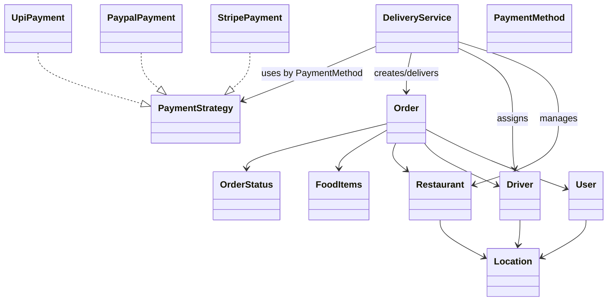
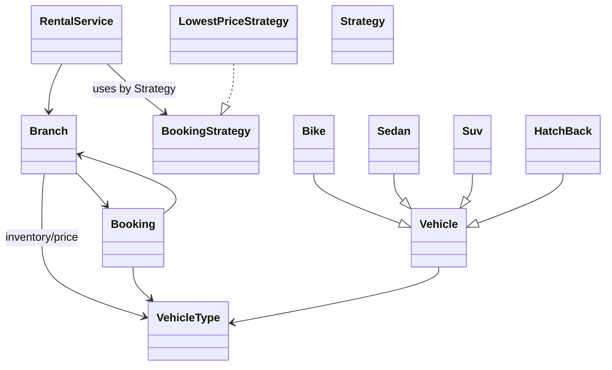
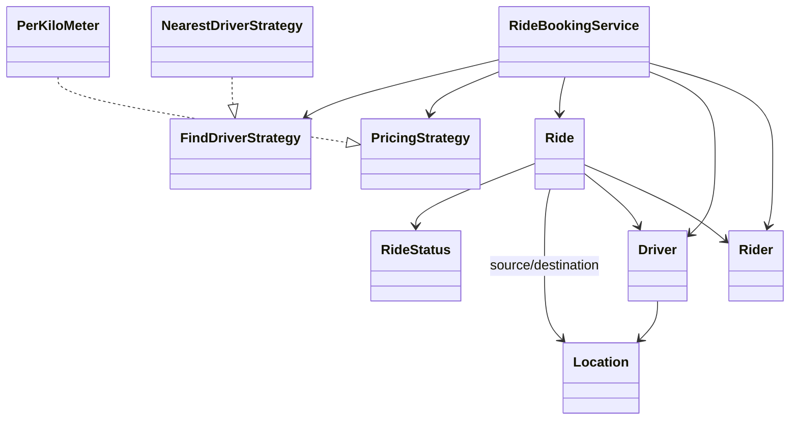
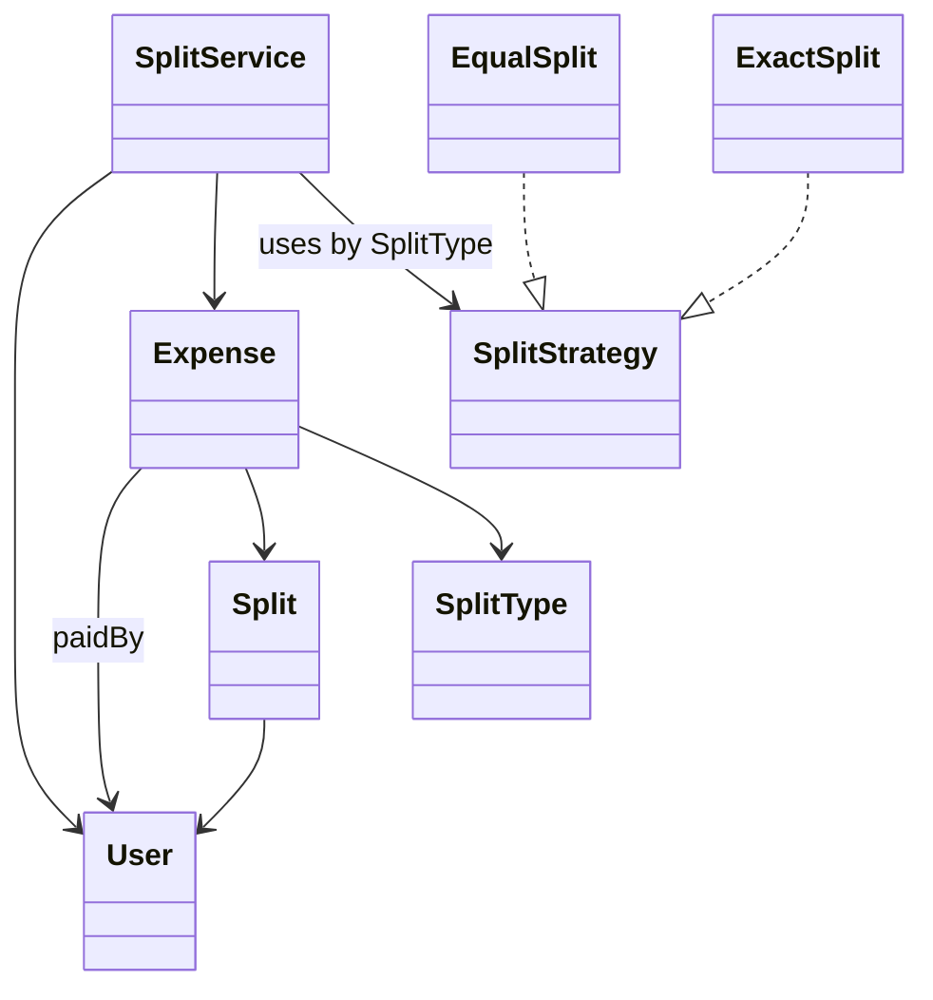
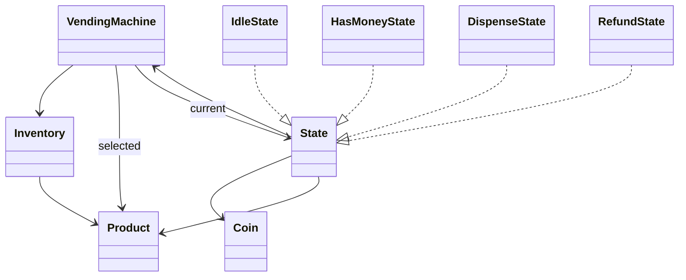
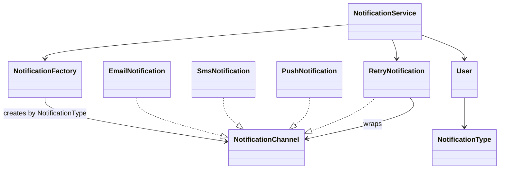
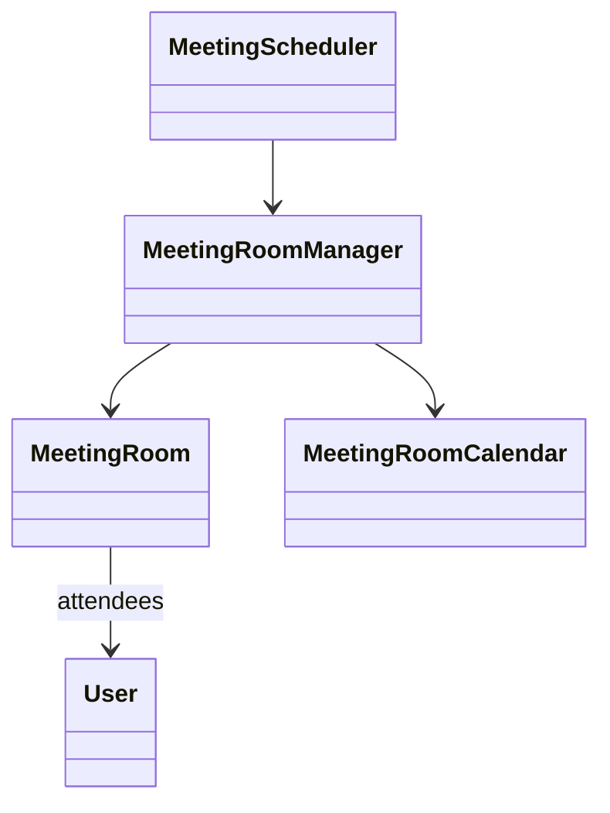
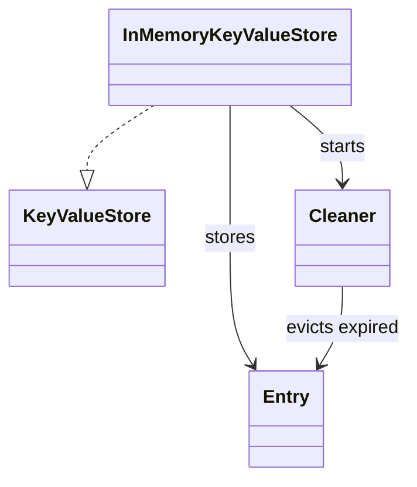
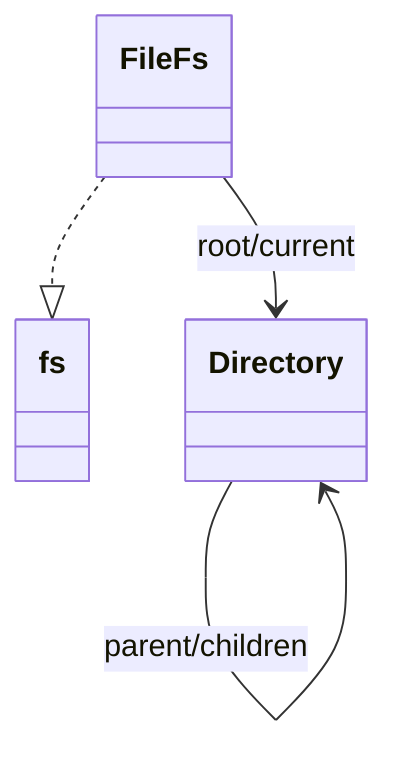
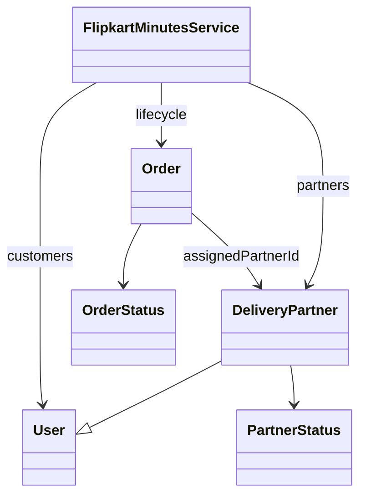

# LowLevelDesign

Quick revision sheet for all LLD implementations in this repo.

## FoodDelivery

```mermaid
classDiagram
class DeliveryService
class User
class Driver
class Restaurant
class Order
class FoodItems
class Location
class PaymentStrategy
class StripePayment
class PaypalPayment
class UpiPayment
class PaymentMethod
class OrderStatus

DeliveryService --> Restaurant : manages
DeliveryService --> Driver : assigns
DeliveryService --> Order : creates/delivers
DeliveryService --> PaymentStrategy : uses by PaymentMethod
StripePayment ..|> PaymentStrategy
PaypalPayment ..|> PaymentStrategy
UpiPayment ..|> PaymentStrategy
Order --> User
Order --> Driver
Order --> Restaurant
Order --> FoodItems
User --> Location
Driver --> Location
Restaurant --> Location
Order --> OrderStatus
```

## VehicleRental

```mermaid
classDiagram
class RentalService
class Branch
class Booking
class BookingStrategy
class LowestPriceStrategy
class Vehicle
class Bike
class Sedan
class Suv
class HatchBack
class VehicleType
class Strategy

RentalService --> Branch
RentalService --> BookingStrategy : uses by Strategy
LowestPriceStrategy ..|> BookingStrategy
Branch --> Booking
Branch --> VehicleType : inventory/price
Booking --> Branch
Booking --> VehicleType
Bike --|> Vehicle
Sedan --|> Vehicle
Suv --|> Vehicle
HatchBack --|> Vehicle
Vehicle --> VehicleType
```

## RideBooking

```mermaid
classDiagram
class RideBookingService
class Rider
class Driver
class Ride
class Location
class PricingStrategy
class PerKiloMeter
class FindDriverStrategy
class NearestDriverStrategy
class RideStatus

RideBookingService --> Rider
RideBookingService --> Driver
RideBookingService --> Ride
RideBookingService --> PricingStrategy
RideBookingService --> FindDriverStrategy
PerKiloMeter ..|> PricingStrategy
NearestDriverStrategy ..|> FindDriverStrategy
Ride --> Rider
Ride --> Driver
Ride --> Location : source/destination
Ride --> RideStatus
Driver --> Location
```

## Splitwise

```mermaid
classDiagram
class SplitService
class User
class Expense
class Split
class SplitType
class SplitStrategy
class EqualSplit
class ExactSplit

SplitService --> User
SplitService --> Expense
SplitService --> SplitStrategy : uses by SplitType
EqualSplit ..|> SplitStrategy
ExactSplit ..|> SplitStrategy
Expense --> User : paidBy
Expense --> Split
Expense --> SplitType
Split --> User
```

## VendingMachine

```mermaid
classDiagram
class VendingMachine
class Inventory
class Product
class Coin
class State
class IdleState
class HasMoneyState
class DispenseState
class RefundState

VendingMachine --> Inventory
VendingMachine --> Product : selected
VendingMachine --> State : current
IdleState ..|> State
HasMoneyState ..|> State
DispenseState ..|> State
RefundState ..|> State
State --> Coin
State --> Product
State --> VendingMachine
Inventory --> Product
```

## NotificationSystem

```mermaid
classDiagram
class NotificationService
class NotificationFactory
class NotificationChannel
class EmailNotification
class SmsNotification
class PushNotification
class RetryNotification
class User
class NotificationType

NotificationService --> NotificationFactory
NotificationService --> RetryNotification
NotificationService --> User
NotificationFactory --> NotificationChannel : creates by NotificationType
EmailNotification ..|> NotificationChannel
SmsNotification ..|> NotificationChannel
PushNotification ..|> NotificationChannel
RetryNotification ..|> NotificationChannel
RetryNotification --> NotificationChannel : wraps
User --> NotificationType
```

## MeetingScheduler

```mermaid
classDiagram
class MeetingScheduler
class MeetingRoomManager
class MeetingRoom
class MeetingRoomCalendar
class User

MeetingScheduler --> MeetingRoomManager
MeetingRoomManager --> MeetingRoom
MeetingRoomManager --> MeetingRoomCalendar
MeetingRoom --> User : attendees
```

## InMemoryKeyValue

```mermaid
classDiagram
class KeyValueStore
class InMemoryKeyValueStore
class Entry
class Cleaner

InMemoryKeyValueStore ..|> KeyValueStore
InMemoryKeyValueStore --> Entry : stores
InMemoryKeyValueStore --> Cleaner : starts
Cleaner --> Entry : evicts expired
```

## FileSystem

```mermaid
classDiagram
class fs
class FileFs
class Directory

FileFs ..|> fs
FileFs --> Directory : root/current
Directory --> Directory : parent/children
```

## FlipkartMinute

```mermaid
classDiagram
class FlipkartMinutesService
class User
class DeliveryPartner
class Order
class OrderStatus
class PartnerStatus

DeliveryPartner --|> User
FlipkartMinutesService --> User : customers
FlipkartMinutesService --> DeliveryPartner : partners
FlipkartMinutesService --> Order : lifecycle
Order --> OrderStatus
DeliveryPartner --> PartnerStatus
Order --> DeliveryPartner : assignedPartnerId
```
